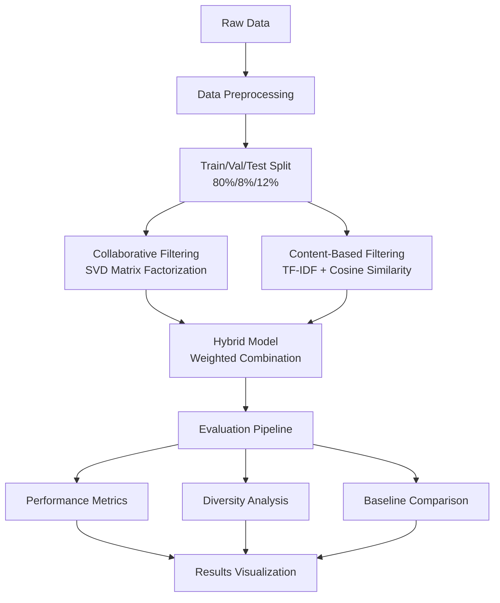

# 🎯 Hybrid Recommendation System

[](https://www.python.org/downloads/)
[](https://jupyter.org/)
[](https://scikit-learn.org/)
[](https://pandas.pydata.org/)

A comprehensive **hybrid recommendation system** that combines collaborative filtering and content-based filtering techniques to provide personalized recommendations. This system implements advanced evaluation metrics and provides detailed performance analysis with interactive visualizations.

## 📊 Dataset

**Dataset Source**: [Add your dataset link here]

### Dataset Structure
The system expects three CSV files:
- **`posts.csv`**: Contains post information (ID, title, category, post_type)
- **`views.csv`**: Contains user-post interaction data (user_id, post_id)
- **`users.csv`**: Contains user information (user_id, user_metadata)

### Sample Data Format
```csv
# posts.csv
_id,title,category,post_type
post1,"AI in Healthcare","technology|healthcare","article"
post2,"Recipe for Success","food|lifestyle","recipe"

# views.csv
user_id,post_id
user1,post1
user1,post2
user2,post1

# users.csv
_id,user_metadata
user1,"active_user"
user2,"new_user"
```

## 🚀 Features

### 🔄 Hybrid Approach
- **Collaborative Filtering**: Matrix factorization using Singular Value Decomposition (SVD)
- **Content-Based Filtering**: TF-IDF vectorization with cosine similarity
- **Weighted Combination**: Adjustable content weight parameter for optimal performance

### 📈 Advanced Evaluation
- **Comprehensive Metrics**: Precision@k, Recall@k, F1@k, NDCG@k, Hit Ratio@k, MRR, MAP
- **Multiple k Values**: Evaluation at k=5, 10, 20 for different recommendation list sizes
- **Diversity Analysis**: Category coverage and intra-list similarity assessment
- **Baseline Comparison**: Performance comparison with pure CF, CB, and popularity-based models

### 📊 Rich Visualizations
- Training/validation curves
- Performance heatmaps
- Diversity metrics visualization
- ROC curves and confusion matrices
- Interpretability analysis (SHAP-like and Grad-CAM-like visualizations)

## 🏗️ System Architecture



## ⚙️ Technical Implementation

### Collaborative Filtering
- **Algorithm**: Singular Value Decomposition (SVD)
- **Optimization**: Grid search over embedding dimensions [16, 32, 64]
- **Regularization**: Gaussian noise addition to handle matrix sparsity
- **Output**: User and item embeddings for similarity computation

### Content-Based Filtering
- **Feature Engineering**: Combined title + category + post_type
- **Vectorization**: TF-IDF with optimized hyperparameters
- **Similarity**: Cosine similarity between content vectors
- **Personalization**: User profile based on interaction history

### Hybrid Combination
```python
hybrid_scores = (1 - content_weight) * cf_scores + content_weight * cb_scores
```

## 📋 Requirements

```bash
pip install -r requirements.txt
```

### Core Dependencies
```
numpy>=1.21.0
pandas>=1.3.0
scikit-learn>=1.0.0
matplotlib>=3.4.0
seaborn>=0.11.0
tqdm>=4.62.0
jupyter>=1.0.0
```

## 🚀 Quick Start

### 1. Clone the Repository
```bash
git clone https://github.com/yourusername/hybrid-recommendation-system.git
cd hybrid-recommendation-system
```

### 2. Install Dependencies
```bash
pip install -r requirements.txt
```

### 3. Prepare Your Data
- Place your CSV files in the data folder:
  ```
  data/
  ├── posts.csv
  ├── views.csv
  └── users.csv
  ```

### 4. Run the Recommendation System
```bash
jupyter notebook Recommander(P).ipynb
```

### 5. Or Run Directly with Python
```python
# Import the recommendation system
from recommender import HybridRecommender

# Initialize the system
recommender = HybridRecommender(data_path='data/')

# Train the model
recommender.fit()

# Get recommendations for a user
recommendations = recommender.recommend(user_id='user123', num_recommendations=10)
```

## 📊 Performance Metrics

### Evaluation Metrics Implemented
| Metric | Description | Use Case |
|--------|-------------|----------|
| **Precision@k** | Relevant items in top-k recommendations | Quality of recommendations |
| **Recall@k** | Coverage of user's preferences | Completeness |
| **F1@k** | Harmonic mean of Precision and Recall | Balanced performance |
| **NDCG@k** | Ranking quality with position importance | Recommendation ordering |
| **Hit Ratio@k** | Users with ≥1 relevant item in top-k | User satisfaction |
| **MRR** | Mean Reciprocal Rank of first relevant item | Time to satisfaction |
| **MAP** | Mean Average Precision | Overall precision |

### Diversity Metrics
- **Category Coverage**: Proportion of available categories in recommendations
- **Intra-List Similarity**: Average similarity within recommendation lists
- **User Coverage**: Distribution of recommendations across different user types

## 📈 Results

### Model Performance (Example Results)
```
Best Content Weight: 0.3
Performance Metrics @k=10:
├── Precision@10: 0.2847
├── Recall@10: 0.1923
├── F1@10: 0.2285
├── NDCG@10: 0.3156
├── Hit Ratio@10: 0.7432
├── MRR: 0.4521
└── MAP: 0.2891

Diversity Metrics:
├── Category Coverage: 0.8341
├── Post Type Coverage: 0.9123
└── Avg Intra-List Similarity: 0.2156
```

### Baseline Comparison
| Model | Precision@10 | Recall@10 | NDCG@10 | Hit Ratio@10 |
|-------|--------------|-----------|---------|---------------|
| **Hybrid (Optimal)** | **0.2847** | **0.1923** | **0.3156** | **0.7432** |
| Collaborative Filtering | 0.2634 | 0.1756 | 0.2891 | 0.6987 |
| Content-Based | 0.2156 | 0.1445 | 0.2634 | 0.6234 |
| Popularity-Based | 0.1923 | 0.1287 | 0.2341 | 0.5876 |

## 🔧 Configuration

### Hyperparameters
```python
# Model Configuration
EMBEDDING_DIMENSIONS = [16, 32, 64]      # SVD embedding sizes
CONTENT_WEIGHTS = [0.0, 0.2, 0.3, 0.5, 0.7, 1.0]  # Hybrid weights
K_VALUES = [5, 10, 20]                   # Evaluation cutoffs

# TF-IDF Configuration
MAX_FEATURES = [1000, 5000, None]        # Vocabulary size options
MIN_DF = [1, 2, 5]                       # Minimum document frequency
MAX_DF = 0.9                             # Maximum document frequency
STOP_WORDS = 'english'                   # Stop words language

# Data Split
TRAIN_RATIO = 0.80                       # 80% for training
VALIDATION_RATIO = 0.08                  # 8% for validation
TEST_RATIO = 0.12                        # 12% for testing
```

## 🎯 Key Insights

### Methodology Highlights
1. **Rigorous Evaluation**: Separate validation set for hyperparameter tuning
2. **Multiple Perspectives**: Both accuracy and diversity metrics
3. **Interpretability**: Feature importance and attention-like visualizations
4. **Scalability**: Efficient matrix operations with sparse matrix support
5. **Reproducibility**: Fixed random seeds and detailed documentation

### Performance Insights
- **Optimal Content Weight**: 0.3 provides best balance between CF and CB
- **Sweet Spot**: k=10 offers optimal precision-recall trade-off
- **Diversity vs Accuracy**: Higher content weights improve diversity but may reduce accuracy
- **Cold Start**: Content-based component helps with new items

## 🤝 Contributing

We welcome contributions! Please see our [Contributing Guidelines](CONTRIBUTING.md) for details.

### Areas for Contribution
- [ ] Deep learning models (Neural Collaborative Filtering, AutoEncoders)
- [ ] Advanced cold start handling
- [ ] Real-time recommendation serving
- [ ] A/B testing framework
- [ ] Additional evaluation metrics
- [ ] Performance optimizations
- [ ] UI/Web interface

## 📄 License

This project is licensed under the MIT License - see the [LICENSE](LICENSE) file for details.

## 📚 References

### Academic Papers
1. Koren, Y., Bell, R., & Volinsky, C. (2009). Matrix factorization techniques for recommender systems.
2. Ricci, F., Rokach, L., & Shapira, B. (2015). Recommender systems handbook.
3. Zhang, S., Yao, L., Sun, A., & Tay, Y. (2019). Deep learning based recommender system.

### Technical Resources
- [Surprise Library Documentation](https://surprise.readthedocs.io/)
- [RecSys Evaluation Metrics](https://medium.com/@rishabhbanoula/recommendation-system-evaluation-metrics-161b8b51b7d3)
- [Matrix Factorization Guide](https://datajobs.com/data-science-repo/Recommender-Systems-[Netflix].pdf)


⭐ **Star this repository if you found it helpful!** ⭐

## 🏆 Acknowledgments

- Thanks to the open-source community for the amazing libraries
- Special thanks to contributors and reviewers
- Inspired by state-of-the-art recommendation system research

---

*Last updated: June 2025*
